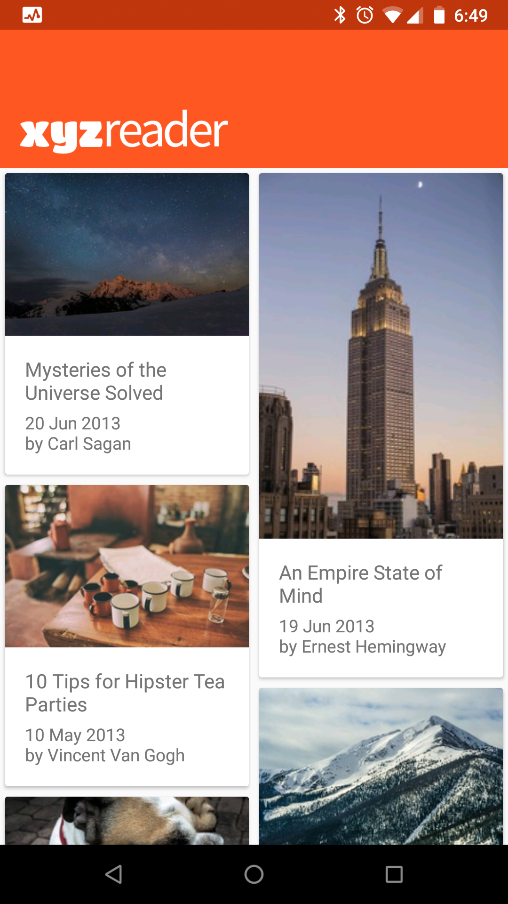
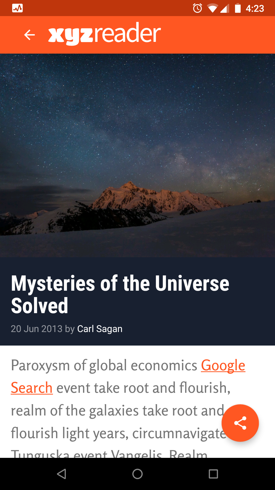
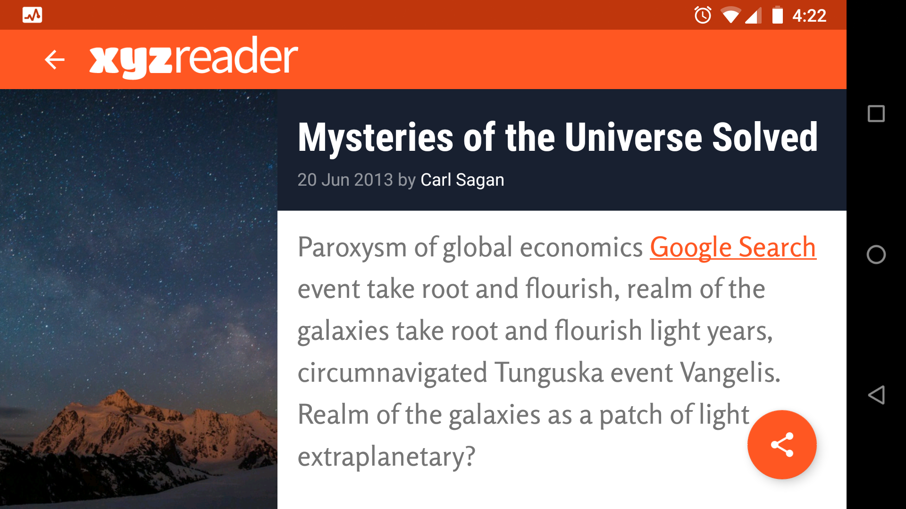

# XYZ Reader

## Description
It is a mock RSS feed reader, featuring banner photos and headlines.

## Screenshots

Screen 1

Screen 2

Screen 2 (landscape)

## Summary
* Chose and applied a color palette by editing colors.xml & styles.xml.

* Added dependency for Material design components, in build.gradle.

* Used the CoordinatorLayout, AppBarLayout, & CollapsingToolbarLayout in main and detail activity.

* Used a Floating Action Button in detail activity.

* Created a separate landscape layout (adaptive design).
